# Architecture

This implementation uses a fully managed serverless ingestion path on AWS:

1. Clients call `POST /events` on an HTTP API endpoint.
2. API Gateway invokes a Python Lambda that authenticates and validates events.
3. Lambda writes validated events to Kinesis Data Firehose using batch writes.
4. Firehose durably stores compressed JSON event files in S3, partitioned by day.
5. Glue + Athena make the data queryable by downstream data teams.

## Diagram

Mermaid source: `docs/architecture.mmd`

```mermaid
flowchart LR
    Client[Web and Mobile Clients] -->|POST /events with x-api-key| APIGW[API Gateway HTTP API]
    APIGW --> Lambda[Ingestion Lambda]
    Lambda -->|PutRecordBatch| Firehose[Kinesis Data Firehose]
    Firehose -->|GZIP JSON| S3[(S3 Raw Events Bucket)]
    S3 --> Glue[Glue Catalog Table]
    Glue --> Athena[Athena Workgroup]
    Athena --> DataTeams[Data Engineering and Data Science]
```

## Tradeoffs

- Why this: managed services reduce operational overhead while staying HA by default.
- Risk: Firehose introduces buffering delay (60s configured), so data is near-real-time, not real-time.
- Mitigation: batch settings can be tuned for lower latency at higher cost.

## Reliability and Scale

- API Gateway and Lambda scale horizontally without manual intervention.
- Firehose is durable and built to absorb ingestion spikes.
- S3 provides 11x9 durability for long-term event storage.

## Security

- TLS in transit through API Gateway.
- Shared secret API key validation in Lambda (`x-api-key`).
- At-rest encryption on S3.
- Least-privilege IAM roles for Lambda and Firehose.
